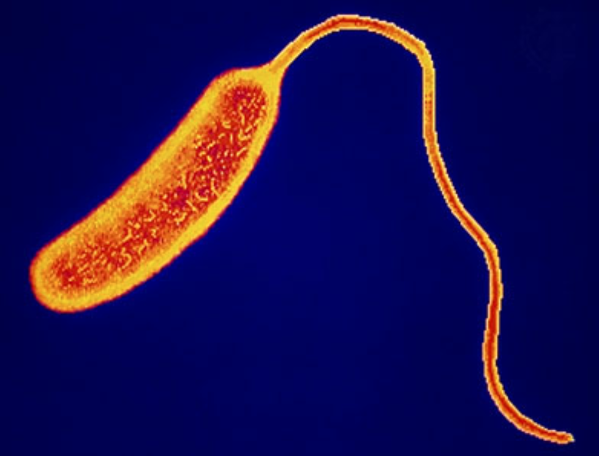
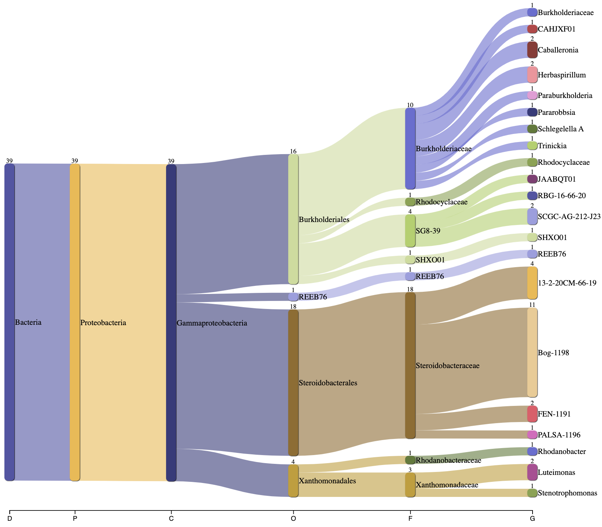

```{r, message="false", warning="false"}
library(tidyverse)
library(knitr)
library(DT)
library(plotly)
library(ggtree)
library(zoo)
library(ggimage)
library(rphylopic)
library(treeio)
library(tidytree)
library(ape)
library(TreeTools)
library(phytools)
library(TDbook) 
library(ggnewscale)
library(ggtreeExtra)
library(ggstar)
```

# Abstract

Soil microbiome research and characterization is an important field of microbiology for its industrial applications and ability to advance biological knowledge. In this project, NEON metagenomic sequencing data (@noauthor_home_nodate) from Toolik Field Station and for the class Gammaproteobacteria was analyzed to characterize the soil microbiome under these two conditions. Phylogenetic visualizations, taxonomic summary graphs, and graphs incorporating environmental data were generated to look for interesting patterns in the data. Findings support the fact that Gammaproteobacteria is an extremely diverse class and analysis of its abundant Burkholderiales order revealed it has five novel genera. Findings from Toolik revealed mostly expected groups present but some lower abundance groups that are uncharacterized like the biogeochemically relevant Armatimonadota.

# Introduction and Motivating Reasons

## Motivating Reasons

Microbiology as a discipline is relatively young and with omics approaches exploding in only the last 15 years, we have really just begun to capture the full extent of microbial diversity. Metagenomic analyses of soil microbial communities suggest that the majority of microbes exist in low abundance in the environment and are unculturable. Because of this we rely on metagenomic studies like the NEON project to discover and characterize new microbial life.

Soil microbes have countless practical applications. From biofertilizer development to the bioremediation of heavy metal pollutants to the synthesis of antibiotics with pharmaceutical applications; the soil microbiome truly has countless applications that greatly improve our quality of life. Besides these practical reasons it is also beneficial to study novel soil microbes because many of them exhibit strange lifestyles that push the boundaries of what is traditionally considered to be life. Understanding these unique metabolisms will further our scientific knowledge and may provide insights into other important biological phenomena.

Toolik Field Station in the Summer (@science_midnight_2019)


Toolik Field Station in the Winter (@science_tower_2016)


## Toolik Field Station

Toolik Lake Research Natural Area (TOOL) is a NEON site near Toolik Field Station, which is located in Alaska. It is an NSF funded LTER station managed by the Institute of Arctic Biology at the University of Alaska Fairbanks (@noauthor_toolik_nodate). Part of the NEON Tundra domain (D18), TOOL is located in the northern foothills of the Brooks Range, which is around 158 miles above the Arctic Circle. The site consists of rolling till plains and moraines, filled with tussock grasses, sedges, and short herbaceous vegetation. There is a flux tower at the center of the site which collects a full profile of atmospheric conditions. Soil sensor measurements and observational sampling are also collected at this site. The climate in this area consists of long, harsh winters in which there is no sunlight and short, cool summers where there is 24-hour sunlight (@neon_science_tool_2019).

Toolik Tower (@science_tool_2017)


## Gammaproteobacteria

Gammaproteobacteria is a Class of bacteria within the Phylum Pseudomonadota (proteobacteria). It is gram negative and consists of both aerobic and anaerobic species. Some of the morphologies of Gammaproteobacteria include rods, curved rods, cocci, spirilla, and filaments (@noauthor_gammaproteobacteria_2024). 

Many Gammaproteobacteria are found in different terrestrial and marine environments. They have a variety of roles important within these environments, a notable one being in hydrothermal vents. Also, there are two types of Gammaproteobacteria, Alteromonadales and Vibrionales, that are significant for nutrient cycling in marine and coastal ecosystems.

Some types of Gammaproteobacteria belong to certain important medical, ecological, and scientific groups of bacteria, in particular those in the families Enterobacteriaceae, Vibrionaceae, and Pseudomonadaceae. This includes some human pathogens such as Yersinia pestis (the Plague), Vibrio cholerae (Cholera), Pseudomonas aeruginosa, Escherichia coli, and some species of Salmonella (@noauthor_gammaproteobacteria_2024).

Vibrio cholerae is a type of Gammaproteobacteria. (@noauthor_cholera_nodate)



## Sankey Plots

Sankey plot showing the individual assemblies of Gammaproteobacteria at all NEON sites:


Sankey plot showing the combined assemblies of Gammaproteobacteria at all NEON sites:



# Methods

To learn more about Toolik Field Station and Gammaproteobacteria, my group decided to separate our data analysis into three parts. The first would be studying all bacteria found at Toolik Field Station, the second is Gammaproteobacteria at all NEON field sites, and the third is Gammaproteobacteria at just Toolik Field Station. Using the collected NEON metagenomic data, we created phylogenetic trees and summary graphs to analyze our field site and bacterial group with the goal of identifying interesting trends in the data.

## Loading in the Data

### NEON MAG Table

```{r, message=FALSE, warning=FALSE}
NEON_MAGs <- read_csv("data/NEON/GOLD_Study_ID_Gs0161344_NEON_2024_4_21.csv") %>% 
  # remove columns that are not needed for data analysis
  select(-c(`GOLD Study ID`, `Bin Methods`, `Created By`, `Date Added`, `Bin Lineage`)) %>% 
  # create a new column with the Assembly Type
  mutate("Assembly Type" = case_when(`Genome Name` == "NEON combined assembly" ~ `Genome Name`,
                            TRUE ~ "Individual")) %>% 
  mutate_at("Assembly Type", str_replace, "NEON combined assembly", "Combined") %>% 
  mutate_at("GTDB-Tk Taxonomy Lineage", str_replace, "d__", "") %>%  
  mutate_at("GTDB-Tk Taxonomy Lineage", str_replace, "p__", "") %>% 
  mutate_at("GTDB-Tk Taxonomy Lineage", str_replace, "c__", "") %>% 
  mutate_at("GTDB-Tk Taxonomy Lineage", str_replace, "o__", "") %>% 
  mutate_at("GTDB-Tk Taxonomy Lineage", str_replace, "f__", "") %>% 
  mutate_at("GTDB-Tk Taxonomy Lineage", str_replace, "g__", "") %>% 
  mutate_at("GTDB-Tk Taxonomy Lineage", str_replace, "s__", "") %>%
  separate(`GTDB-Tk Taxonomy Lineage`, c("Domain", "Phylum", "Class", "Order", "Family", "Genus", "Species"), ";", remove = FALSE) %>% 
  mutate_at("Domain", na_if,"") %>% 
  mutate_at("Phylum", na_if,"") %>% 
  mutate_at("Class", na_if,"") %>% 
  mutate_at("Order", na_if,"") %>% 
  mutate_at("Family", na_if,"") %>% 
  mutate_at("Genus", na_if,"") %>% 
  mutate_at("Species", na_if,"") %>% 
  
  # Get rid of the the common string "Soil microbial communities from "
  mutate_at("Genome Name", str_replace, "Terrestrial soil microbial communities from ", "") %>% 
  # Use the first `-` to split the column in two
  separate(`Genome Name`, c("Site","Sample Name"), " - ") %>% 
  # Get rid of the the common string "S-comp-1"
  mutate_at("Sample Name", str_replace, "-comp-1", "") %>%
  # separate the Sample Name into Site ID and plot info
  separate(`Sample Name`, c("Site ID","subplot.layer.date"), "_", remove = FALSE,) %>% 
  # separate the plot info into 3 columns
  separate(`subplot.layer.date`, c("Subplot", "Layer", "Date"), "-") 
```

```{r}
NEON_MAGs_bact_ind <- NEON_MAGs %>% 
  filter(Domain == "Bacteria") %>% 
  filter(`Assembly Type` == "Individual")
```

### NEON Metagenome Information

```{r, message=FALSE, warning=FALSE}
NEON_metagenomes <- read_tsv("data/NEON/exported_img_data_Gs0161344_NEON.tsv") %>% 
  rename(`Genome Name` = `Genome Name / Sample Name`) %>% 
  filter(str_detect(`Genome Name`, 're-annotation', negate = T)) %>% 
  filter(str_detect(`Genome Name`, 'WREF plot', negate = T))
```

```{r, message=FALSE, warning=FALSE}
NEON_metagenomes <- NEON_metagenomes %>% 
  # Get rid of the the common string "Soil microbial communities from "
  mutate_at("Genome Name", str_replace, "Terrestrial soil microbial communities from ", "") %>% 
  # Use the first `-` to split the column in two
  separate(`Genome Name`, c("Site","Sample Name"), " - ") %>% 
  # Get rid of the the common string "-comp-1"
  mutate_at("Sample Name", str_replace, "-comp-1", "") %>%
  # separate the Sample Name into Site ID and plot info
  separate(`Sample Name`, c("Site ID","subplot.layer.date"), "_", remove = FALSE,) %>% 
  # separate the plot info into 3 columns
  separate(`subplot.layer.date`, c("Subplot", "Layer", "Date"), "-")
```

### NEON Chemistry Data

```{r, message=FALSE, warning=FALSE}
NEON_chemistry <- read_tsv("data/NEON/neon_plot_soilChem1_metadata.tsv") %>% 
  # remove -COMP from genomicsSampleID
  mutate_at("genomicsSampleID", str_replace, "-COMP", "")
```

### NEON Combined Data

```{r}
NEON_combined <- full_join(NEON_MAGs, NEON_metagenomes, by = "Sample Name") %>%
  full_join(NEON_chemistry, by = c("Sample Name" = "genomicsSampleID"))
```

#### Filter to Gammaproteobacteria

```{r}
NEON_combined_gamma <- NEON_combined %>%
  filter(str_detect(`Class`, "Gammaproteobacteria"))
```

#### Filter to Toolik Field Station

```{r}
NEON_combined_gamma_tool <- NEON_combined_gamma %>%
  filter(str_detect(`Site.x`, "Toolik Field Station"))
```

```{r}
NEON_combined_tool <- NEON_combined %>%
  filter(str_detect(`Site.x`, "Toolik Field Station"))
```

#### Reading in Phylogenetic Tree Files

```{r}
tree_arc <- read.tree("data/NEON/gtdbtk.ar53.decorated.tree")
tree_bac <- read.tree("data/NEON/gtdbtk.bac120.decorated.tree")
```


# Results

## Part I: Toolik Field Station

### Phylogenetic Trees

```{r}
TOOL_MAGs_label <- NEON_combined_tool$`Bin ID`
```

```{r}
tree_bac_TOOL_MAGs <-drop.tip(tree_bac,tree_bac$tip.label[-match(TOOL_MAGs_label, tree_bac$tip.label)])
```

```{r, fig.width=10}
ggtree(tree_bac_TOOL_MAGs, layout="circular")  %<+%
  NEON_combined +
  geom_point(mapping=aes(color=Phylum)) 
```
Figure 1. An overview of the phylogenetic relationships between all phyla present at Toolik Filed Station. The most abundant groups, Acidobacteria, Pseudomonadota, and Actinomycetota are all known to dominate soil environments.

```{r, fig.width=10, warning=FALSE}
ggtree(tree_bac_TOOL_MAGs, layout="circular")  %<+%
  NEON_combined + 
  geom_point2(mapping=aes(color= `Bin Completeness`, size=`Total Number of Bases`))
```
Figure 2. Phylogenetic tree showing relationship between bin completeness and total number of base pairs. The largest MAGs appear to be the most complete while smaller MAGs are less complete. This may be the result of 1. the bins actually being incomplete or 2. binning programs labelling obligate symbionts as being incomplete because they lack key genes necessary for life.

### Taxonomic Breakdown 

```{r}
NEON_MAGs_TOOL <- NEON_MAGs_bact_ind %>%
   filter(str_detect(`Site ID`, "TOOL"))
```

```{r}
NEON_MAGs_TOOL %>% 
  ggplot(aes(x = fct_infreq(Phylum), fill=`Phylum`)) +
    geom_bar() +
    coord_flip() +
    xlab("Phylum") +
    ylab("Number of MAGs") +
    ggtitle("Figure 3. Number of MAGs per Phylum at Toolik")
```

Figure 3. Phyla present at Toolik Field Station. There are 12 total phyla present. The most abundant phyla are all known to dominate soil. There are lesser characterized phyla present in lower abundance like Patescibacteria (unculturable nanobacteria) and the ecologically relevant Armatimonadota that can degrade complex carbohydrates. Specifically our class of focus Gammaproteobacteria is within the Pseudomonadota phylum.

```{r, fig.width=12}
NEON_MAGs_TOOL %>% 
ggplot(aes(x = fct_rev(fct_infreq(Phylum)), fill = Class)) +
  geom_bar() +
  coord_flip() +
  xlab("Phylum") +
  ylab("Number of MAGs") +
  ggtitle("Figure 4. Number of MAGs per Phylum at Toolik")
```

Figure 4. All phyla present at Toolik colored by Order. Notably, Gammaproteobacteria comprises around half of all Psuedomontada. 

```{r, fig.width=12}
NEON_MAGs_TOOL %>% 
  ggplot(aes(x = fct_rev(fct_infreq(Class)), fill=`Order`)) +
  geom_bar() +
  coord_flip() +
  xlab("Class") +
  ylab("Number of MAGs") +
  ggtitle("Figure 5. Number of MAGs per Class at Toolik")
```

Figure 5.  Classes present at Toolik Field Station, colored by Order. A total of 18 Gammaproteobacteria are present at the site. It is slightly less abundant than Alphaproteobacteria, the other class within its phylum.

```{r}
ggplotly(
NEON_MAGs_TOOL %>% 
ggplot(aes(x = fct_rev(fct_infreq(Phylum)), y = `Total Number of Bases`, color = `Class`)) +
  geom_point() +
  coord_flip() +
  xlab("Phylum") +
  ylab("MAG Size (base pairs)") +
  ggtitle("Figure 6. MAG Size per Phylum at Toolik")
)
```

Figure 6. MAG size per phylum at Toolik. Most MAGs are between 2 and 5 Mb. There are some phyla that are outside the normal distribution. Specifically there are two Patescibacteria MAGs below 1 Mb, two Planctomycetota MAGs around and above 8 Mb and two Pseudomonadota MAGs around and above 8 Mb. Pseudomonadota has a particularly wide range of genome sizes ranging from around 1.2 Mb to 8.5 Mb. Alphaproteobacteria are larger on average than Gammaproteobacteria.

```{r, fig.width=8}
NEON_MAGs_TOOL1 <- NEON_MAGs_TOOL %>%
  mutate(Phylum = as.factor(Phylum))

NEON_MAGs_TOOL1 %>%
  ggplot(aes(x = `Gene Count`, y = `Total Number of Bases`, color = Phylum)) +
  geom_point() +
  coord_flip() +
  geom_jitter() +
  xlab("Gene Count") + 
  ylab("MAG Size (base pairs)") +
  ggtitle("Figure 7. Relationship Between MAG Size and Gene Count at Toolik")
```

Figure 7. The relationship between MAG size and gene counts for all MAGs at Toolik. Colored by phylum to once again display average sizes of the phyla present at Toolik. There is a clearly positive relationship between genome size and number of genes present which is expected.

```{r, fig.width=8}
NEON_MAGs_TOOL1 <- NEON_MAGs_TOOL %>%
  mutate(Phylum = as.factor(Phylum))

NEON_MAGs_TOOL1 %>%
  ggplot(aes(x = `Bin Completeness`, y = `Total Number of Bases`, color = Phylum)) +
  geom_point() +
  coord_flip() +
  geom_jitter() +
  xlab("MAG Completeness") + 
  ylab("MAG Size (base pairs)") +
  ggtitle("Figure 8. Relationship Between MAG Size and Completeness at Toolik")
```

Figure 8. Relationship between MAG size and completeness colored by phylum. There is no obvious positive correlation between MAG size and completion, although the least complete MAGs around 50% are all on the smaller side.  

### Environmental Factors

#### pH

```{r, fig.width=8}
NEON_combined_tool %>% 
ggplot(aes(x = fct_rev(fct_infreq(Phylum)), y = soilInWaterpH, color = Phylum)) +
  geom_boxplot() +
  coord_flip() +
  xlab("Phylum") +
  ylab("Soil pH in Water") +
  ggtitle("Figure 9. Relationship Between Soil pH and Phyla Present at Toolik")
```

Figure 9. Soils at Toolik are acidic ranging from 4.8 - 6.2. There are many phyla enriched at acidic pHs like Pseudomonadota, Acidobacteriota, Myxococcota, and Verrucomicrobiola. There are also phyla present in soils of all pHs like Actinomycetota and Bacteroidota. Overall all MAGs at Toolik are growing in acidic conditions.

#### Soil Temperature

```{r, fig.width=8}
NEON_combined_tool %>% 
ggplot(aes(x = fct_rev(fct_infreq(Phylum)), y = soilTemp)) +
  geom_boxplot() +
  coord_flip() +
  xlab("Phylum") +
  ylab("Soil Temperature (Celsius)") +
  ggtitle("Figure 10. Relationship Between Soil Temperature and Phyla Present at Toolik")
```

Figure 10. Soils at Toolik are of low temperatures, ranging from 2 - 8 °C. Most bacteria at Toolik are most abundant around 5 °C. There are some phyla that favor higher temperatures from 7 - 8 °C like Planctomycetota while there are others that favor lower temperatures from 3 - 4.5 °C like Pseudomonadota.

```{r, fig.width=8}
NEON_combined_tool %>% 
ggplot(aes(x = soilInWaterpH, y = soilTemp, color = Subplot.y)) +
  geom_point() +
  coord_flip() +
  xlab("Soil pH in Water") +
  ylab("Soil Temperature (Celsius)") +
  ggtitle("Figure 11. Relationship Between Soil Temperature and Soil pH per Subplot at Toolik")
```

Figure 11. There is no direct correlation between soil pH and temperature. Most subplots sampled have acidic pHs from 5-5.4 and low temperatures from 2-4°C. Three subplots sampled have higher temperatures at and over 8°C.

#### Elevation

```{r, fig.width=8}
NEON_combined_tool %>% 
ggplot(aes(x = fct_rev(fct_infreq(Phylum)), y = elevation)) +
  geom_boxplot() +
  coord_flip() +
  xlab("Phylum") +
  ylab("Elevation (m)") +
  ggtitle("Figure 12. Relationship Between Elevation and Phyla Present at Toolik")
```

Figure 12. There is no major relationship between the phyla present and elevation of the soil sample. Interestingly, abundant groups have different relationships with elevation. For example, the abundant phylum Actinomycetota has a wide range of elevations whereas the second most abundant phylum Pseudomonadota has a very small range of elevations it is observed at.

#### Land Cover Type

```{r, fig.width=10}
NEON_combined_tool %>% 
   ggplot(aes(x=`Phylum`, fill=Class)) +
  geom_bar() +
  coord_flip() +
  facet_wrap(vars(nlcdClass), scales="free_y", ncol=3) +
  labs(title="Figure 13. Relationship Between National Land Cover Type and Phyla Present at Toolik", x= "Phylum", y="Number of MAGs") +  
  theme_classic() +
  theme(legend.position = "bottom")
```

Figure 13. The distribution of phyla between the three different national land cover types. Dwarf shrubs are shrubs under 20 cm tall, shrub scrubs are shrubs under 5 meters tall where the overall vegetation is at least 20% shrub, and sedge herbaceous are areas composed of at least 80% sedges and forbs. The two most abundant phyla, Acidobacteriota and Pseudomonadota, are significantly less prevalent in shrub scrubs than other land cover types. Within Pseudomonadota, Gammaproteobacteria is more prevelant in shrub scrubs and Alphaproteobacteria is more prevelant in dwarf shrubs.

## Part II: Gammaproteobacteria

### Phylogenetic Trees

```{r}
gamma_MAGs_label <- NEON_combined_gamma$`Bin ID`
```

```{r}
tree_bac_gamma_MAGs <-drop.tip(tree_bac,tree_bac$tip.label[-match(gamma_MAGs_label, tree_bac$tip.label)])
```

```{r}
# Make a vector with the internal node labels
node_vector_bac_gamma = c(tree_bac_gamma_MAGs$tip.label,tree_bac_gamma_MAGs$node.label)

# Search for your Phylum or Class to get the node
grep("Burkholderiales", node_vector_bac_gamma, value = TRUE)
```

```{r}
match(grep("Burkholderiales", node_vector_bac_gamma, value = TRUE), node_vector_bac_gamma)
```

```{r}
grep("Steroidobacterales", node_vector_bac_gamma, value = TRUE)
```

```{r}
match(grep("Steroidobacterales", node_vector_bac_gamma, value = TRUE), node_vector_bac_gamma)
```

```{r}
grep("Xanthomonadales", node_vector_bac_gamma, value = TRUE)
```

```{r}
match(grep("Xanthomonadales", node_vector_bac_gamma, value = TRUE), node_vector_bac_gamma)
```

```{r}
ggtree(tree_bac_gamma_MAGs, layout="circular", branch.length="none") +
  
    geom_hilight(node=126, fill="lightblue", alpha=.6) +
    geom_cladelab(node=126, label="Burkholderiales", align=TRUE, hjust=-0.3, offset = 0, textcolor='lightblue', barcolor='lightblue') +

    geom_hilight(node=179, fill="lightgreen", alpha=.6) +
    geom_cladelab(node=179, label="Steroidobacterales", align=TRUE, vjust=1.5, offset = 0, textcolor='lightgreen', barcolor='lightgreen') +
  
      geom_hilight(node=232, fill="violet", alpha=.6) +
    geom_cladelab(node=232, label="Xanthomonadales", align=TRUE, hjust=1.1, offset = 0, textcolor='violet', barcolor='violet') 
```

Figure 14. Phylogenetic tree of the three major Gammaproteobacteria orders present in the NEON data. The most abundant order is Steroidobacterales, the second most abundant is Burkholderiales, and the third most abundant is Xanthomonadales. Burkholderiales is the msot phylogenetically distinct among the three orders as it forms its own clade at the highest level on the tree.

```{r}
NEON_combined_gamma_burk <- NEON_combined_gamma %>% 
   filter(`Order` == "Burkholderiales") %>% 
  filter(`Assembly Type` == "Individual")

burk_MAGs_label <- NEON_combined_gamma_burk$`Bin ID`

tree_bac_burk_MAGs <-drop.tip(tree_bac,tree_bac$tip.label[-match(burk_MAGs_label, tree_bac$tip.label)])
```

```{r, fig.height=5, fig.width=8, warning=FALSE}
ggtree(tree_bac_burk_MAGs, layout="circular")  %<+%
  NEON_combined + 
 geom_point2(mapping=aes(color= `Family`, size=`Total Number of Bases`))
```

Figure 15. Phylogenetic tree of the abundant and diverse Burkholderiales order. The dominant family is Burkholderiaceae which has its own subfamilies and forms its own clade spanning most of the tree. The remaining adjacent clade is comprised of many different families at low abundance.

### Taxonomic Breakdown

```{r, fig.width=10}
NEON_combined_gamma %>% 
ggplot(aes(x = fct_rev(fct_infreq(Order)), fill = Site.x)) +
  geom_bar() +
  coord_flip() +
  xlab("Orders") +
  ylab("Number of MAGs") +
  ggtitle("Figure 16. Numbers of Gammaproteobacteria by Order")
```

Figure 16. The numbers of Gammaproteobacteria MAGs per order. This is colored by site. There are three orders that dominate the Gammaproteobacteria in the NEON data. There are 6 significantly less abundant orders that only show up at 1 site each. 

```{r, fig.width=11, fig.height=13}
NEON_combined_gamma %>% 
ggplot(aes(x = Order, fill = Family)) +
  geom_bar(position = position_dodge2(width = 0.9, preserve = "single")) +
  coord_flip() +
  facet_wrap(vars(Site.x), scales = "free", ncol = 2) +
  xlab("Orders") +
  ylab("Number of MAGs") +
  ggtitle("Figure 17. Numbers of Gammaproteobacteria by Order in Each Site")
```

Figure 17. The numbers of Gammaproteobacteria orders per site colored by family. Once again out of all orders, Burkholderiales continues to be the most diverse at the family level and widespread within all of the sites sampled.

```{r, fig.height=7, fig.width=7}
NEON_combined_gamma %>% 
ggplot(aes(x = fct_rev(fct_infreq(Order)), fill = Family)) +
  geom_bar(position = position_dodge2(width = 0.9, preserve = "single")) +
  coord_flip() +
  xlab("Orders") +
  ylab("Number of MAGs") +
  ggtitle("Figure 18. Numbers of Gammaproteobacteria by Order")
```

Figure 18. The numbers of Gammaproteobacteria MAGs per order. This is colored by family. Interestingly all members of the most abundant order are of the same family whereas the second most abundant order has a 10 different orders. This is likely because most/all members of Steroidobacterales are of the same family.

```{r}
ggplotly(
  NEON_combined_gamma %>%
  filter(is.na(Order) | is.na(Family) | is.na(Genus)) %>%
  ggplot(aes(x = Order, fill = Family)) +
  geom_bar() +
  coord_flip() +
  guides(fill = "none") +
  labs(
    title = "Figure 19. Orders of Gammaproteobacteria with Novel Bacteria",
    x = "Order",
    y = "Number of Novel Bacteria"
  )
)
```

Figure 19. The number of novel Gammaproteobacteris present int he data set. The second most abundant order, Burkholderiales, has the highest number of novel MAGs.


## Part III: Gammaproteobacteria at Toolik Field Station

This graph shows the total MAG counts for different Families of Gammaproteobacteria at Toolik Field Station. The Families were colored by Genus.

```{r}
NEON_combined_gamma_tool %>%
  ggplot(aes(x = fct_rev(fct_infreq(Family)), fill=`Genus`)) +
  geom_bar(position = position_dodge2(width = 0.9, preserve = "single")) +
  coord_flip() +
  labs(title = "MAG Counts of Families of Gammaproteobacteria in TOOL", x = "Family", y = "Count") +
  theme(legend.text = element_text(size = 8),  
        legend.key.size = unit(0.5, "cm"))
```

This graph shows the In-situ soil temperatures of soil at approximately 10cm deep that different Families of Gammaproteobacteria were collected.

```{r}
NEON_combined_tool %>%
  filter(str_detect(`Class`, "Gammaproteobacteria")) %>%
  ggplot(aes(x = `soilTemp`, fill = Family)) +
  geom_bar() +
  coord_flip() +
  labs(title = "Families of Gammaproteobacteria at Different Soil Temperatures in TOOL", x = "Soil Temperature (ºC)", y = "Count")
```

This graph shows the National Land Cover Database Vegetation Types and the dates their samples were collected.

```{r}
NEON_combined_tool %>%
  filter(str_detect(`Class`, "Gammaproteobacteria")) %>%
  ggplot(aes(y = `Sample Collection Date`, fill = `nlcdClass`)) +
  geom_bar() +
  coord_flip() +
  labs(title = "NLCD Vegetation Type and Sample Collection Date", x = "nlcdClass", y = "Date")
```

This graph shows how the pH of the soil collected that was measured in calcium chloride solution changes depending on the elevation. It was filtered to show only Gammaproteobacteria in Toolik Field Station and is colored by Genus.

```{r}
ggplotly(
  NEON_combined_tool %>%
  filter(str_detect(`Class`, "Gammaproteobacteria")) %>%
    ggplot(aes(x = `soilInCaClpH`, y = `Elevation In Meters`)) +
  geom_point(aes(color=Genus)) +
  labs(title = "Effects of Elevation on the pH of Soil Measured in CaCl", x = "Soil in CaCl Solution (pH)", y = "Elevation (m)")
)
```

This graph shows the Orders of Gammaproteobactera at Toolik Field Station that have novel bacteria.

```{r}
NEON_MAGS_bact_ind_gamma <- NEON_MAGs_bact_ind %>%
  filter(str_detect(`Class`, "Gammaproteobacteria"))

ggplotly(
  NEON_MAGS_bact_ind_gamma %>%
  filter(is.na(Order) | is.na(Family) | is.na(Genus)) %>%
  ggplot(aes(x = Order, fill = Family)) +
  geom_bar() +
  coord_flip() +
  guides(fill = "none") +
  labs(
    title = "Orders of Gammaproteobacteria with Novel Bacteria",
    x = "Order",
    y = "Number of Novel Bacteria"
  )
)
```


### Phylogenetic Trees

# Discussion and Conclusion

# References
